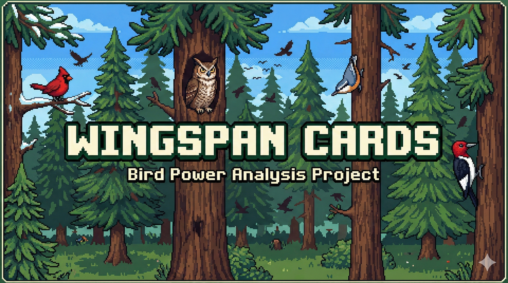

# Wingspan Card Values

A data analysis project exploring what makes a Wingspan bird card valuable. The centerpiece is a regression analysis that models each card's victory point value as a function of its cost, physical traits, and power mechanics.

## Data

`assets/master_bird_data.json` — 596 bird cards drawn from the Wingspan base game and expansions, sourced from navarog's [wingsearch](https://github.com/navarog/wingsearch/tree/master/src), originally compiled by [tawnyfrogmouth](https://boardgamegeek.com/filepage/193164/wingspan-spreadsheet-bird-cards-bonus-cards-end-of).

Each record captures a card's victory points, food cost, nest type, egg limit, wingspan, habitat(s), power color, power text, bonus card eligibility, predator flag, and flocking flag.

## Project Structure

```
assets/          Source data (master_bird_data.json)
src/
  load_data.py   Loads JSON into a pandas DataFrame
  features.py    Feature engineering — transforms raw data into regression inputs
notebooks/       Jupyter notebooks for exploratory analysis and modeling
output/          Generated plots and model outputs (gitignored)
```

## Analysis: `power_value_regression`

The regression analysis asks: **which card attributes predict victory point value, and by how much?**

### Feature Engineering (`src/features.py`)

`build_feature_matrix()` transforms raw card data into a ~45-column feature matrix. Key feature groups:

**Food cost**
- `weighted_food_cost` — rarity-adjusted cost based on Oceania/Asia expansion dice probabilities. Common foods (invertebrate, seed, nectar: 2-in-6 per die) are weighted 1.0; rare foods (fish, fruit, rodent: 1-in-6) are weighted 2.0. For or-cost birds (`/`), the player's cheapest available option is used.
- `total_food_cost` — raw food count for comparison
- `has_or_cost`, `has_predator_cost`, `nectar_required` — cost structure flags

**Physical traits**
- `egg_limit` — eggs the bird can hold (scoring and engine value)
- `wingspan_cm`, `star_wingspan` — numeric wingspan and flightless flag
- `nest_bowl`, `nest_cavity`, `nest_platform`, `star_nest`, `nest_none` — nest type dummies (ground is reference)
- `habitat_count` — number of habitats the bird can occupy (1–3)

**Bonus card eligibility**
- `bonus_count` — how many of the 26 bonus cards this bird qualifies for

**Power color**
- `has_power`, `color_brown`, `color_white`, `color_teal`, `color_pink`, `color_yellow`

**Power mechanics** (parsed from `power_text` via regex)
- Binary flags: `mech_gain_food`, `mech_draw_card`, `mech_lay_egg`, `mech_tuck`, `mech_cache`, `mech_from_supply`, `mech_from_feeder`, `mech_reset_feeder`, `mech_bonus_card`, `mech_play_bird`, `mech_repeat_copy`, `mech_other_player`, `mech_discard_to_gain`, `mech_flocking`
- Numeric magnitude: `mech_max_tuck_count`, `mech_max_egg_count`, `mech_max_draw_count`, `mech_max_food_count`

**Predator sub-types** (classified from power text)
- `pred_look_wingspan` — hunts by checking prey wingspan against a threshold
- `pred_roll_dice` — rolls dice, succeeds if target food appears
- `pred_play_on_top` — white predators that overlay another bird
- `pred_pay_card` — white predators with card-for-rodent substitution
- `pred_other` — all other predator-tagged birds
- `pred_success_prob` — estimated hunt success probability (0–1), computed analytically from dice probabilities and the distribution of wingspan values in the card pool

### Setup

```bash
# Create and activate virtual environment
python -m venv .venv_wingspan
.venv_wingspan\Scripts\activate   # Windows
# source .venv_wingspan/bin/activate  # macOS/Linux

pip install -r requirements.txt
```

### Usage

```python
from src.load_data import load_bird_data
from src.features import build_feature_matrix

df = load_bird_data()           # 596 rows, raw columns
feat = build_feature_matrix(df) # regression-ready feature matrix
```

Run the data loader as a script to inspect column coverage:

```bash
python -m src.load_data
```

Run the feature builder as a script to see feature stats and food rarity weights:

```bash
python -m src.features
```

## Dependencies

- Python 3
- pandas >= 2.0, numpy >= 1.24, scipy >= 1.10
- matplotlib >= 3.7, seaborn >= 0.12
- jupyter >= 1.0
